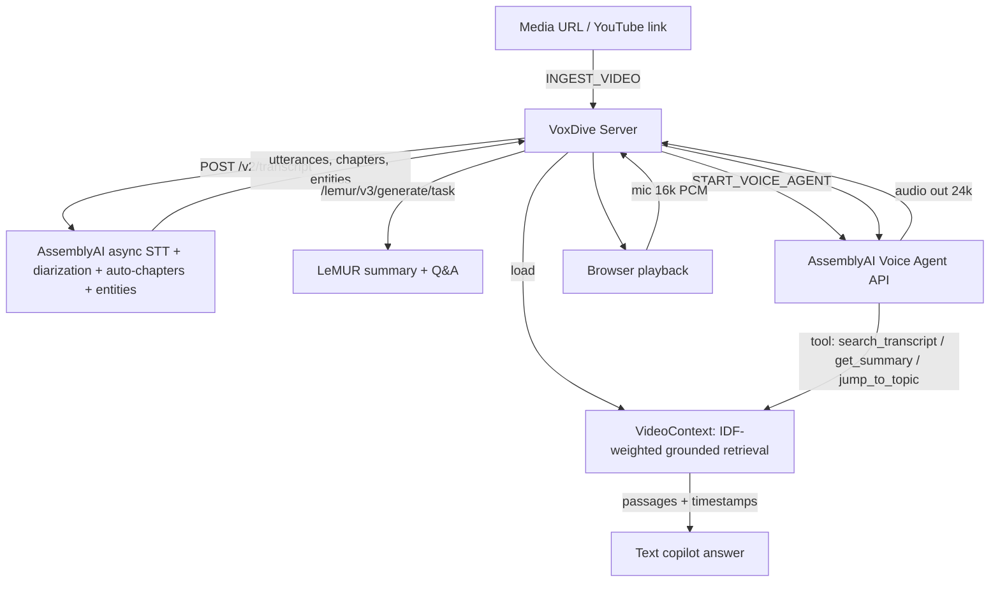

# Technical Specification: VoxDive
**Project Name:** VoxDive — Talk to Any Video or Podcast (AssemblyAI Voice Agent Hackathon)
**Status:** Implemented prototype
**Version:** 1.0.0

> **Implementation status:** Real async AssemblyAI STT + speaker diarization + auto-chapters + entity detection, LeMUR (Claude-powered) summary and grounded Q&A, and a Voice Agent API session grounded by a `search_transcript` tool. IDF-weighted deterministic retrieval and a bundled sample transcript make the full experience demoable offline. Static HTML/Tailwind UI. Offline suite green, 98% line coverage on the logic core.

---

## 1. System Architecture
A media URL is transcribed asynchronously by AssemblyAI, normalized into a provider-agnostic transcript, and loaded into a per-connection grounding store. A text copilot answers via LeMUR (live) or local retrieval (offline). A full-duplex Voice Agent session lets the user talk to the content, with every answer routed through a transcript-search tool.



---

## 2. Pipeline Specification

### 2.1 Transcription
- `POST /v2/transcript` with `speaker_labels`, `auto_chapters`, `entity_detection`; polled until `completed`.
- Utterance `start`/`end` (ms) → seconds; speakers labeled `Speaker A/B/…`.
- One-paragraph summary via LeMUR; degrades to stitched chapter summaries on failure.

### 2.2 Grounding & retrieval
- Retrieval scores segments by **IDF-weighted** query-term overlap over diarized text, with a phrase-containment bonus; conversational fillers are stop-worded out.
- Off-topic queries (no positive score) return an explicit "not covered" answer with no citations — the agent never fabricates.

### 2.3 Voice conversation & barge-in
- Audio in: 16 kHz mono 16-bit PCM (Web Audio `AudioWorkletProcessor`). Audio out: 24 kHz PCM.
- Turn detection + `interrupt_response`; client halts playback immediately on user speech (barge-in), measured server-side.

---

## 3. Data Protocols

### 3.1 Client → Server
```typescript
type ClientMessage =
  | { action: 'INGEST_VIDEO'; url: string; title?: string }
  | { action: 'RUN_SIMULATION' }                 // offline sample walkthrough
  | { action: 'START_VOICE_AGENT'; voice?: string }
  | { action: 'STOP_VOICE_AGENT' }
  | { action: 'ASK_COPILOT'; query: string }
  | { action: 'EXPORT_NOTE' }
  | { action: 'INTERRUPT' }
  | ArrayBuffer /* 16kHz PCM mic audio (binary) */;
```

### 3.2 Server → Client
```typescript
type ServerMessage =
  | { type: 'TRANSCRIBING'; message: string; isMock: boolean }
  | { type: 'TRANSCRIPT_SEGMENT'; start: number; speaker: string; text: string }
  | { type: 'TRANSCRIPT_READY'; title: string; summary: string; chapters: Chapter[]; segments: Segment[]; speakers: string[] }
  | { type: 'COPILOT_ANSWER'; answer: string; citations: Citation[]; engine: 'lemur' | 'local-retrieval' }
  | { type: 'VOICE_AGENT_READY' | 'AGENT_REPLY_AUDIO' | 'AGENT_TRANSCRIPT' | 'TOOL_EXECUTED' | 'LATENCY' | 'INTERRUPTED'; /* … */ }
  | { type: 'EXPORT_DATA'; markdown: string };
```

---

## 4. Acceptance Criteria
1. A pasted media URL (or the bundled sample) yields a diarized transcript, auto-chapters, and a summary.
2. Every spoken/typed answer is drawn from the transcript and cites a timestamp; unrelated questions are declined, not invented.
3. Full-duplex voice with instant barge-in; turnaround and barge-in latency are measured and surfaced (`/api/metrics`, HUD).
4. Full experience runs offline with no API key via the bundled sample.
