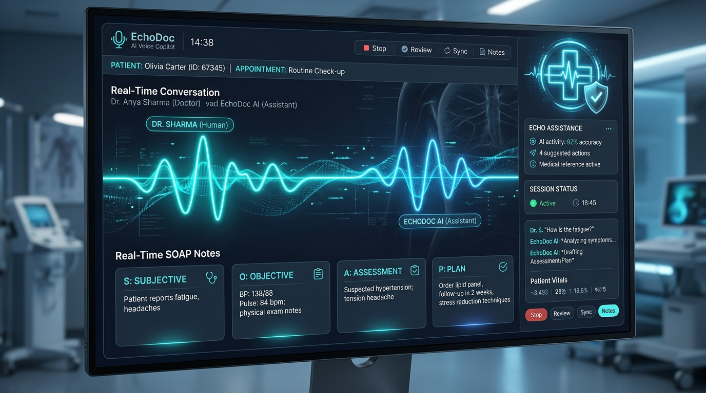

# 🩺 EchoDoc — Pitch Deck & Executive Summary
**Sub-Second Clinical Voice Scribe & Conversational Diagnostic Copilot**  
*Built for the AssemblyAI Voice Agent Hackathon 2026 on Lablab.ai*



---

##  Slide 1: Cover & Mission
* **Product:** EchoDoc AI
* **Tagline:** The fastest path from spoken clinical encounter to structured SOAP documentation and real-time patient safety.
* **Core Technology:** AssemblyAI Universal-3.5-Pro Streaming STT (v3) + AssemblyAI Voice Agent API (v1)
* **Team:** Antigravity Builders
* **Live Demo:** [GitHub Repository](https://github.com/akmalkhaniub/echodoc-voice-agent)

---

## Slide 2: The Problem (The Physician Burnout Epidemic)
* **2:1 Administrative Overhead:** Clinicians spend 2 hours documenting in EHRs for every 1 hour of direct patient care.
* **Cognitive Overload:** Typing while interviewing compromises bedside manner, eye contact, and patient trust.
* **Silent Medication Hazards:** Over 1.3 million adverse drug events occur annually in the US alone; critical drug interactions are frequently missed in fast-paced consultations.
* **Delayed Note Finalization:** Clinicians often spend 1–2 hours of "pajama time" every evening completing backlog charts.

---

## Slide 3: The Solution — EchoDoc Dual-Pipeline Architecture
EchoDoc combines two breakthrough Voice AI primitives into a single clinical workspace:

1. **Passive Ambient Scribe (Universal-3.5-Pro Streaming v3):**
   * Listens invisibly to the doctor-patient dialogue.
   * Leverages AssemblyAI's `domain: "medical-v1"` and `speech_model: "universal-3-5-pro"`.
   * Real-time speaker diarization separating Clinician from Patient.
   * Auto-extracts 4-quadrant structured SOAP notes (Subjective, Objective, Assessment, Plan) in sub-second latency.

2. **Active Voice Diagnostic Copilot (Voice Agent API v1):**
   * Full-duplex conversational voice assistant with natural speech output (`anna` voice).
   * Clinicians can verbally query patient vitals, medication histories, and clinical summaries.
   * Native interruptibility (barge-in): speaking immediately halts assistant audio playback.

---

## Slide 4: Real-Time Clinical Sentinel (Safety Innovation)
* **Active Pharmacology Guard:** Built-in drug-drug interaction (DDI) sentinel evaluates medications in real time.
* **Instant Hazard Interception:**
  * Detects lethal pairs like *Warfarin + Ibuprofen* (GI hemorrhage risk) or *Sildenafil + Nitroglycerin* (cardiovascular collapse).
  * Automatically fires a visual safety alert bar and prompts the Voice Copilot to warn the clinician before a prescription is written.
* **AssemblyAI Tool Calling:** Uses flat-schema tools (`check_contraindications`, `get_clinical_summary`) executed seamlessly by the Voice Agent.

---

## Slide 5: Product Architecture
```
[ Browser Web Audio Worklet ] ──( 16kHz PCM Stream )──> [ Node.js Microservice ]
                                                              │
                    ┌─────────────────────────────────────────┴─────────────────────────────────────────┐
                    ▼                                                                                   ▼
   [ AssemblyAI Streaming STT v3 ]                                                     [ AssemblyAI Voice Agent API v1 ]
  • universal-3-5-pro (min_latency)                                                   • Full-duplex WebSocket (24kHz PCM)
  • domain: "medical-v1"                                                              • anna voice + barge-in interruption
  • speaker_labels: true (Doctor vs Patient)                                          • Flat-schema Clinical Tools:
                    │                                                                   - check_contraindications(drugs)
                    ▼                                                                   - get_clinical_summary(section)
   [ Clinical Inference Engine ] ───────────────────────────────────────────────────────────────────────┘
  • Real-time 4-Quadrant SOAP Extraction (S, O, A, P)
  • Drug-Drug Interaction Sentinel
  • One-click Markdown/EHR Export
```

---

## Slide 6: Market Opportunity (TAM / SAM / SOM)
* **Total Addressable Market (TAM):** $32.4 Billion by 2030 (Global Healthcare AI & Clinical Documentation market, 28.5% CAGR).
* **Serviceable Addressable Market (SAM):** $6.8 Billion (Ambient Clinical Intelligence & Digital Scribe solutions).
* **Serviceable Obtainable Market (SOM):** $420 Million (Ambulatory clinics, independent medical practices, and digital telehealth platforms).

---

## Slide 7: Business Model & Monetization
1. **Free Tier:** Up to 3 consultations/day with local simulator mode and standard STT (ideal for trial and testing).
2. **Professional Clinician ($79 / month per seat):**
   * Unlimited live Universal-3.5-Pro streaming consultations.
   * Full-duplex Voice Copilot with tool execution.
   * Clinical contraindication sentinel and unlimited SOAP note exports.
3. **Enterprise Health Systems ($149 / seat / mo + usage):**
   * Epic, Cerner, and AthenaHealth EHR integrations.
   * Custom hospital formulary rules and dedicated cloud tenancy.

---

## Slide 8: Competitive Advantage
| Capability | Legacy Dictation (Nuance/Dragon) | Ambient Recorders (Abridge/Nuance DAX) | EchoDoc AI |
| :--- | :---: | :---: | :---: |
| **Real-Time Turn Latency** | Slow (Post-encounter batch) | 30s – 5min batch processing | **Sub-Second (~600ms)** |
| **Conversational Voice Copilot** | ❌ No | ❌ No | ✅ **Yes (Voice Agent API)** |
| **Real-Time Contraindication Sentinel** | ❌ No | ❌ No | ✅ **Yes (Instant Alerts)** |
| **Full Barge-in Interruptibility** | ❌ N/A | ❌ N/A | ✅ **Yes (Hardware-level)** |
| **Open & Self-Hostable** | ❌ Proprietary silo | ❌ Closed enterprise | ✅ **Docker / Cloud Ready** |

---

## Slide 9: Product Roadmap
* **Q4 2026 (Now):** AssemblyAI Voice Agent API v1 & Universal-3.5-Pro integration, SOAP note generator, DDI sentinel.
* **Q1 2027:** Fast Healthcare Interoperability Resources (FHIR) JSON export + Epic EHR sandbox connector.
* **Q2 2027:** Native iOS / iPadOS ambient scribe companion app with Apple Watch dictation trigger.
* **Q3 2027:** Multi-language clinical consultation support (Spanish, French, German via Universal-3.5-Pro multilingual code-switching).

---

## Slide 10: Conclusion & Hackathon Submission
* **Working Demo:** Full ambient audio streaming + Voice Agent Q&A running live.
* **Repository:** [github.com/akmalkhaniub/echodoc-voice-agent](https://github.com/akmalkhaniub/echodoc-voice-agent)
* **Hackathon Portal:** Lablab.ai AssemblyAI Voice Agent Hackathon 2026
